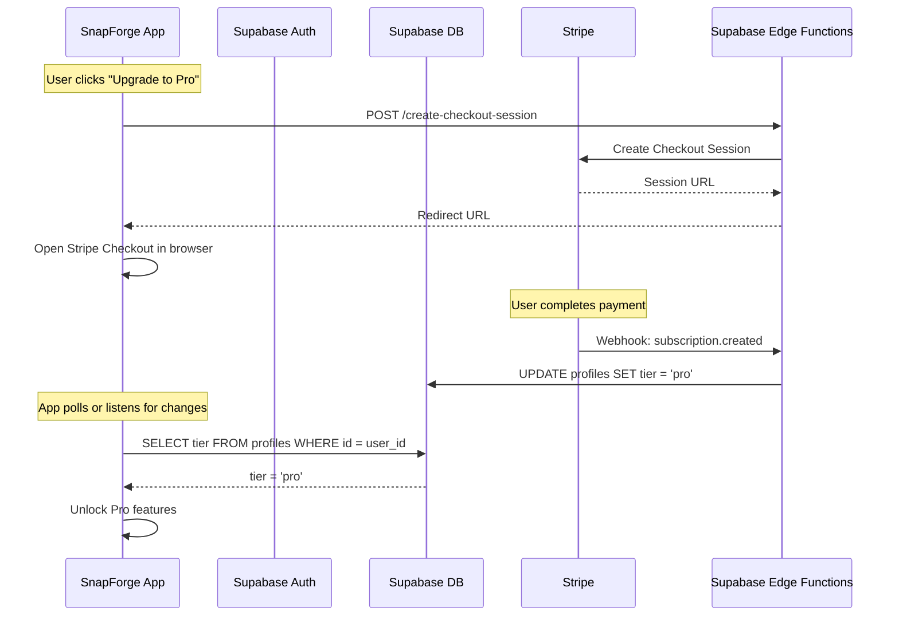

# 🔥 SnapForge — Cross-Platform Screenshot App (macOS + Windows)

> A premium, lightning-fast screenshot tool that captures, annotates, and shares with style — built for macOS first, engineered for Windows from day one.

---

## Background & Vision

We're building a cross-platform desktop screenshot application inspired by **Lightshot** but engineered to compete with premium tools like **CleanShot X**, **Shottr**, and **Xnapper**. The app — **SnapForge** — will combine speed and simplicity with powerful annotation, AI-powered features, and beautiful output styling.

**Primary target:** macOS. **Secondary target:** Windows — with the architecture designed so the Windows port requires **zero rewrites** and only platform-specific configuration changes.

### Competitive Landscape

| App | Strengths | Weaknesses (Our Opportunity) |
|---|---|---|
| **Lightshot** | Simple, fast, free, cross-platform | No OCR, no scrolling capture, outdated UI, privacy concerns |
| **CleanShot X** | All-in-one pro suite, cloud sharing | macOS only, paid subscription ($29+), can feel bloated |
| **Shottr** | Ultra-lightweight, pixel tools, free | macOS only, no screen recording, minimal cloud features |
| **Xnapper** | Beautiful screenshot backgrounds | macOS only, limited annotation, narrow use case |
| **Zight** | Team collaboration, instant links | Enterprise-focused, paid |

### Our Edge — What Makes SnapForge Unique
1. **Truly Cross-Platform** — Same app, same UX on macOS AND Windows (competitors are macOS-only)
2. **AI Smart Redact** — Auto-detect & blur emails, phone numbers, SSNs, credit cards
3. **Screenshot Beautifier** — One-click professional backgrounds (like Xnapper, but built-in)
4. **Pixel Inspector** — Color picker + screen ruler + zoom (like Shottr)
5. **Smart OCR** — Extract text from any screenshot with one click
6. **Screenshot Library with AI Search** — Every capture is indexed, tagged, and searchable
7. **Generous Free Tier + Pro Subscription** — Core features free forever, advanced features unlocked with Pro

---

## User Review Required

> [!IMPORTANT]
> **Tech Stack Decision: Electron + React**
> I recommend **Electron** with **React** for the frontend. This is the ideal choice for cross-platform:
> - Electron runs identically on macOS, Windows, and Linux
> - `desktopCapturer` API works on all platforms with minimal differences
> - Single codebase — no separate builds needed for platform logic
> - Massive ecosystem of packages (canvas, sharp, tesseract.js for OCR)
>
> **Trade-off:** Electron apps are heavier (~150MB) vs native (~10MB). However, this is the most pragmatic choice for a cross-platform app with complex UI.

> [!WARNING]
> **App Name: "SnapForge"**
> This is a working name. Please confirm if you'd like to keep it or suggest an alternative before we proceed.

---

## Cross-Platform Strategy

The entire app is designed with a **Platform Abstraction Layer** so that platform-specific code is isolated and the rest of the app is fully shared.

### What's Shared (99% of the codebase)

| Layer | Shared? | Notes |
|---|---|---|
| React UI (renderer) | ✅ 100% | All components, styles, themes |
| Annotation Editor (Fabric.js) | ✅ 100% | Canvas-based, platform-independent |
| OCR / AI Services | ✅ 100% | Tesseract.js runs in any browser/Node |
| Screenshot Library | ✅ 100% | Local file indexing + UI |
| State Management (Zustand) | ✅ 100% | Pure JavaScript |
| IPC Bridge | ✅ 100% | Electron IPC is cross-platform |
| Supabase Backend | ✅ 100% | REST API calls |

### What Differs Per Platform (< 1% of code)

| Concern | macOS | Windows | Abstraction Strategy |
|---|---|---|---|
| **Hotkeys** | `Cmd+Shift+1/2/3/4` | `Ctrl+Shift+1/2/3/4` | `platform.ts` maps `CmdOrCtrl` modifier |
| **Permissions** | Screen Recording + Accessibility prompts required | No special permissions needed | `permissions.ts` — macOS checks, Windows no-ops |
| **Default Save Path** | `~/Desktop/SnapForge/` | `%USERPROFILE%\Desktop\SnapForge\` | `os.homedir()` + `path.join()` |
| **System Tray** | Menu bar icon (top bar) | System tray icon (bottom taskbar) | Electron `Tray` handles this automatically |
| **App Icon** | `.icns` format | `.ico` format | Both included in `/resources` |
| **Installer** | `.dmg` | `.exe` (NSIS) + `.msi` | `electron-builder` config handles both |
| **Entitlements** | `entitlements.mac.plist` | Not needed | Conditional build config |
| **Startup on Login** | `login-items` API | Registry / Task Scheduler | `app.setLoginItemSettings()` cross-platform |
| **GPU edge cases** | Rarely an issue | May need `--disable-d3d11` flag | Conditional flag in `main/index.ts` |

### Platform Abstraction Layer

```
src/main/platform/
├── index.ts              # Auto-detects OS, exports the right module
├── platform.mac.ts       # macOS-specific: permissions, entitlements
├── platform.win.ts       # Windows-specific: GPU flags, registry
└── platform.types.ts     # Shared interface all platforms implement
```

```typescript
// platform.types.ts — The contract every platform must fulfill
export interface PlatformAdapter {
  getModifierKey(): 'Cmd' | 'Ctrl';
  getDefaultSavePath(): string;
  checkScreenCapturePermission(): Promise<boolean>;
  requestScreenCapturePermission(): Promise<void>;
  getAcceleratorPrefix(): string;    // 'CmdOrCtrl' for Electron
  configureGPU(): void;              // Windows GPU workarounds
  registerAutoStart(enabled: boolean): void;
}
```

```typescript
// index.ts — Factory that picks the right adapter
import { PlatformAdapter } from './platform.types';

export function createPlatformAdapter(): PlatformAdapter {
  if (process.platform === 'darwin') {
    return new (require('./platform.mac')).MacPlatformAdapter();
  } else if (process.platform === 'win32') {
    return new (require('./platform.win')).WinPlatformAdapter();
  }
  throw new Error(`Unsupported platform: ${process.platform}`);
}
```

> [!TIP]
> **The key insight:** By using `'CmdOrCtrl'` in all Electron `globalShortcut.register()` calls, hotkeys automatically map to `Cmd` on macOS and `Ctrl` on Windows — zero code changes needed.

---

## 💰 Monetization & Freemium Architecture

The app follows a **freemium model**: the core screenshot + annotation experience is **free forever**, while advanced AI, cloud, and power-user features are gated behind a **Pro subscription**.

### Business Model

| | **Free Tier** | **Pro Tier** |
|---|---|---|
| **Price** | $0 forever | ~$4.99/mo or ~$39.99/yr |
| **Target** | Casual users, students, developers | Power users, designers, content creators |
| **Goal** | Build massive user base, word-of-mouth | Revenue from users who get daily value |

### Free vs Pro — Feature Breakdown

| Feature | Free | Pro |
|---|---|---|
| **Region / Full / Window Capture** | ✅ Unlimited | ✅ Unlimited |
| **Copy to Clipboard** | ✅ | ✅ |
| **Save to File (PNG/JPG)** | ✅ | ✅ |
| **Quick Action Toolbar** | ✅ | ✅ |
| **Menu Bar / Tray Icon** | ✅ | ✅ |
| **Basic Annotations** (arrow, rect, text, pen) | ✅ | ✅ |
| **Crop & Resize** | ✅ | ✅ |
| **Undo / Redo** | ✅ | ✅ |
| **Dark / Light Theme** | ✅ | ✅ |
| **Customizable Hotkeys** | ✅ | ✅ |
| | | |
| **Blur / Pixelate Tool** | ⚡ 3 uses/day | ✅ Unlimited |
| **Step Counters** | ❌ | ✅ |
| **Highlight Tool** | ❌ | ✅ |
| **Emoji Stamps** | ❌ | ✅ |
| **Color Picker / Eyedropper** | ❌ | ✅ |
| | | |
| **OCR Text Extraction** | ⚡ 5 uses/day | ✅ Unlimited |
| **AI Smart Redact (PII)** | ❌ | ✅ |
| **Screenshot Beautifier** | ⚡ 3 presets | ✅ All presets + custom |
| **QR Code Scanner** | ❌ | ✅ |
| **Screen Ruler** | ❌ | ✅ |
| **Pixel Zoom Inspector** | ❌ | ✅ |
| **Similar Image Search** | ❌ | ✅ |
| | | |
| **Screenshot Library** | ⚡ Last 50 screenshots | ✅ Unlimited history |
| **AI-Powered Tags** | ❌ | ✅ |
| **Full-Text Search (OCR)** | ❌ | ✅ |
| **Cloud Upload + Share Links** | ⚡ 5 links/month | ✅ Unlimited |
| **Export Formats** | PNG, JPG only | ✅ + WebP, PDF, SVG |
| **Scrolling Capture** | ❌ | ✅ |
| **GIF Recording** | ❌ | ✅ |
| **Start on Login** | ❌ | ✅ |
| **Priority Support** | ❌ | ✅ |

> [!TIP]
> **The free tier is deliberately generous.** The core capture + basic annotation flow must feel complete. Users upgrade because they hit usage limits on advanced features or want the full beautifier/AI tool suite — not because the free version feels crippled.

### Technical Architecture — How Feature Gating Works



### Auth & Licensing Flow

1. **No Account Required for Free Tier** — The app works fully offline without any sign-in for all free features
2. **Sign-in Required for Pro** — Users create a Supabase Auth account (email/password or OAuth) to unlock Pro
3. **Stripe Checkout** — Upgrade flow opens Stripe Checkout in the system browser (not inside Electron — this is a security best practice)
4. **Webhook Sync** — Stripe webhooks notify a Supabase Edge Function, which updates the user's `tier` field in the `profiles` table
5. **License Validation** — On app launch, the app checks the user's tier from Supabase. A **7-day offline grace period** allows Pro features to work without internet
6. **Customer Portal** — Users manage billing, update payment, or cancel via Stripe's hosted Customer Portal (accessed from Settings)

### Feature Gating Implementation

```typescript
// src/shared/features.ts — Central feature registry
export enum UserTier {
  FREE = 'free',
  PRO = 'pro'
}

export interface FeatureConfig {
  tier: UserTier;           // Minimum tier required
  dailyLimit?: number;      // Optional daily usage limit for free tier
  label: string;            // Display name
}

export const FEATURES: Record<string, FeatureConfig> = {
  // ── Always Free ──
  'capture.region':       { tier: UserTier.FREE, label: 'Region Capture' },
  'capture.fullscreen':   { tier: UserTier.FREE, label: 'Full Screen Capture' },
  'capture.window':       { tier: UserTier.FREE, label: 'Window Capture' },
  'edit.arrow':           { tier: UserTier.FREE, label: 'Arrow Tool' },
  'edit.rect':            { tier: UserTier.FREE, label: 'Rectangle Tool' },
  'edit.text':            { tier: UserTier.FREE, label: 'Text Tool' },
  'edit.pen':             { tier: UserTier.FREE, label: 'Freehand Drawing' },
  'edit.crop':            { tier: UserTier.FREE, label: 'Crop & Resize' },
  'edit.undo':            { tier: UserTier.FREE, label: 'Undo / Redo' },
  
  // ── Free with Limits ──
  'edit.blur':            { tier: UserTier.FREE, dailyLimit: 3, label: 'Blur Tool' },
  'smart.ocr':            { tier: UserTier.FREE, dailyLimit: 5, label: 'OCR' },
  'smart.beautifier':     { tier: UserTier.FREE, dailyLimit: 3, label: 'Beautifier' },
  'cloud.share':          { tier: UserTier.FREE, dailyLimit: 5, label: 'Share Links' },
  
  // ── Pro Only ──
  'edit.highlight':       { tier: UserTier.PRO, label: 'Highlight Tool' },
  'edit.steps':           { tier: UserTier.PRO, label: 'Step Counters' },
  'edit.emoji':           { tier: UserTier.PRO, label: 'Emoji Stamps' },
  'edit.colorpicker':     { tier: UserTier.PRO, label: 'Color Picker' },
  'smart.redact':         { tier: UserTier.PRO, label: 'AI Smart Redact' },
  'smart.qr':             { tier: UserTier.PRO, label: 'QR Code Scanner' },
  'smart.ruler':          { tier: UserTier.PRO, label: 'Screen Ruler' },
  'smart.pixelzoom':      { tier: UserTier.PRO, label: 'Pixel Zoom' },
  'smart.imagesearch':    { tier: UserTier.PRO, label: 'Similar Image Search' },
  'library.unlimited':    { tier: UserTier.PRO, label: 'Unlimited Library' },
  'library.aitags':       { tier: UserTier.PRO, label: 'AI Tags' },
  'library.textsearch':   { tier: UserTier.PRO, label: 'Full-Text Search' },
  'export.advanced':      { tier: UserTier.PRO, label: 'WebP/PDF/SVG Export' },
  'capture.scrolling':    { tier: UserTier.PRO, label: 'Scrolling Capture' },
  'capture.gif':          { tier: UserTier.PRO, label: 'GIF Recording' },
  'system.autostart':     { tier: UserTier.PRO, label: 'Start on Login' },
};
```

```typescript
// src/renderer/hooks/useFeatureGate.ts
import { useAuthStore } from '../store/authStore';
import { FEATURES, UserTier } from '../../shared/features';

export function useFeatureGate(featureKey: string) {
  const { tier, dailyUsage } = useAuthStore();
  const feature = FEATURES[featureKey];
  
  if (!feature) return { allowed: false, reason: 'Unknown feature' };
  
  // Pro users get everything
  if (tier === UserTier.PRO) return { allowed: true };
  
  // Free tier: check if feature requires Pro
  if (feature.tier === UserTier.PRO) {
    return { 
      allowed: false, 
      reason: 'pro_required',
      label: feature.label 
    };
  }
  
  // Free tier with daily limit
  if (feature.dailyLimit) {
    const used = dailyUsage[featureKey] || 0;
    if (used >= feature.dailyLimit) {
      return { 
        allowed: false, 
        reason: 'limit_reached',
        limit: feature.dailyLimit,
        used,
        label: feature.label
      };
    }
  }
  
  return { allowed: true };
}
```

```tsx
// src/renderer/components/FeatureGate.tsx — Reusable wrapper component
import { useFeatureGate } from '../hooks/useFeatureGate';

export function FeatureGate({ 
  feature, 
  children, 
  fallback 
}: { 
  feature: string; 
  children: React.ReactNode;
  fallback?: React.ReactNode;
}) {
  const gate = useFeatureGate(feature);
  
  if (gate.allowed) return <>{children}</>;
  
  // Show upgrade prompt or disabled state
  return fallback || <UpgradePrompt feature={feature} reason={gate.reason} />;
}

// Usage in annotation toolbar:
<FeatureGate feature="edit.highlight">
  <HighlightTool />
</FeatureGate>

<FeatureGate feature="smart.ocr">
  <OCRButton />
</FeatureGate>
```

### Supabase Database Schema (for Monetization)

```sql
-- User profiles with subscription tier
CREATE TABLE profiles (
  id UUID PRIMARY KEY REFERENCES auth.users(id) ON DELETE CASCADE,
  email TEXT,
  full_name TEXT,
  tier TEXT DEFAULT 'free' CHECK (tier IN ('free', 'pro')),
  stripe_customer_id TEXT UNIQUE,
  subscription_status TEXT DEFAULT 'none' 
    CHECK (subscription_status IN ('none', 'active', 'past_due', 'canceled', 'trialing')),
  subscription_end_date TIMESTAMPTZ,
  created_at TIMESTAMPTZ DEFAULT NOW(),
  updated_at TIMESTAMPTZ DEFAULT NOW()
);

-- Track daily feature usage for free tier limits
CREATE TABLE feature_usage (
  id UUID PRIMARY KEY DEFAULT gen_random_uuid(),
  user_id UUID REFERENCES profiles(id),
  feature_key TEXT NOT NULL,
  usage_date DATE DEFAULT CURRENT_DATE,
  count INTEGER DEFAULT 1,
  UNIQUE(user_id, feature_key, usage_date)
);

-- Screenshot metadata for cloud library
CREATE TABLE screenshots (
  id UUID PRIMARY KEY DEFAULT gen_random_uuid(),
  user_id UUID REFERENCES profiles(id),
  filename TEXT NOT NULL,
  storage_path TEXT,
  share_slug TEXT UNIQUE,
  ocr_text TEXT,
  tags TEXT[],
  width INTEGER,
  height INTEGER,
  file_size INTEGER,
  created_at TIMESTAMPTZ DEFAULT NOW()
);

-- RLS: Users can only access their own data
ALTER TABLE profiles ENABLE ROW LEVEL SECURITY;
ALTER TABLE feature_usage ENABLE ROW LEVEL SECURITY;
ALTER TABLE screenshots ENABLE ROW LEVEL SECURITY;

CREATE POLICY "Users read own profile" ON profiles
  FOR SELECT USING (auth.uid() = id);

CREATE POLICY "Users read own usage" ON feature_usage
  FOR ALL USING (auth.uid() = user_id);

CREATE POLICY "Users manage own screenshots" ON screenshots
  FOR ALL USING (auth.uid() = user_id);
```

### Supabase Edge Functions (Stripe Integration)

```
supabase/functions/
├── create-checkout-session/    # Creates Stripe Checkout for upgrade
│   └── index.ts
├── create-portal-session/      # Opens Stripe Customer Portal
│   └── index.ts
├── stripe-webhook/             # Handles subscription lifecycle events  
│   └── index.ts
└── validate-license/           # Validates user's current tier
    └── index.ts
```

**Key webhook events handled:**
- `customer.subscription.created` → Set tier to `pro`
- `customer.subscription.updated` → Update subscription status
- `customer.subscription.deleted` → Revert tier to `free`
- `invoice.payment_failed` → Set status to `past_due`

### Offline License Caching

```typescript
// src/main/licensing.ts
import Store from 'electron-store';

const store = new Store({ encryptionKey: 'snapforge-license' });

export class LicenseManager {
  private readonly GRACE_PERIOD_DAYS = 7;
  
  async validateLicense(): Promise<UserTier> {
    try {
      // Try online validation first
      const profile = await supabase.from('profiles')
        .select('tier, subscription_status, subscription_end_date')
        .eq('id', userId)
        .single();
      
      // Cache the result locally
      store.set('license', {
        tier: profile.data.tier,
        status: profile.data.subscription_status,
        validatedAt: new Date().toISOString(),
        expiresAt: profile.data.subscription_end_date
      });
      
      return profile.data.tier;
    } catch (error) {
      // Offline: check cached license
      return this.getOfflineLicense();
    }
  }
  
  private getOfflineLicense(): UserTier {
    const cached = store.get('license') as any;
    if (!cached) return UserTier.FREE;
    
    const daysSinceValidation = this.daysBetween(
      new Date(cached.validatedAt), new Date()
    );
    
    // Grace period: allow Pro features for 7 days offline
    if (cached.tier === 'pro' && daysSinceValidation <= this.GRACE_PERIOD_DAYS) {
      return UserTier.PRO;
    }
    
    return UserTier.FREE;
  }
}
```

> [!IMPORTANT]
> **Security principle:** Feature gating in the UI is for UX only. The **real enforcement** happens server-side:
> - Supabase RLS policies prevent free users from accessing Pro-only API data
> - Cloud upload limits are enforced by Edge Functions checking the user's tier
> - The Electron app is treated as an **untrusted client** — all sensitive logic runs on the server

---

## Feature Set — Complete Breakdown

### 🎯 Phase 1: Core Capture Engine (MVP)

| Feature | Description | macOS | Windows | Priority |
|---|---|---|---|---|
| **Global Hotkey Trigger** | Activate capture mode via keyboard shortcut | `Cmd+Shift+2` | `Ctrl+Shift+2` | 🔴 Critical |
| **Region Selection** | Click-and-drag crosshair overlay to select any screen area | ✅ | ✅ | 🔴 Critical |
| **Full Screen Capture** | One-click full screen capture | ✅ | ✅ | 🔴 Critical |
| **Window Capture** | Hover over a window to auto-detect and capture it | ✅ | ✅ | 🟡 Important |
| **Copy to Clipboard** | Instantly copy to system clipboard | ✅ | ✅ | 🔴 Critical |
| **Save to File** | Save as PNG/JPG to configurable directory | ✅ | ✅ | 🔴 Critical |
| **Quick Action Toolbar** | Floating toolbar: Copy / Save / Edit / Discard | ✅ | ✅ | 🔴 Critical |
| **Menu Bar / Tray Icon** | Persistent icon with quick actions | Menu Bar | System Tray | 🔴 Critical |
| **System Notifications** | Toast notification with capture preview | ✅ | ✅ | 🟡 Important |
| **Repeat Last Capture** | Re-capture same region as previous screenshot | ✅ | ✅ | 🟢 Nice |

---

### 🎨 Phase 2: Annotation & Editing

| Feature | Description | Cross-Platform? | Priority |
|---|---|---|---|
| **Arrow Tool** | Customizable arrows with color, thickness, head style | ✅ 100% | 🔴 Critical |
| **Rectangle / Circle** | Outlined or filled shapes | ✅ 100% | 🔴 Critical |
| **Freehand Drawing** | Pen tool for free drawing | ✅ 100% | 🔴 Critical |
| **Text Tool** | Text labels with font, size, color customization | ✅ 100% | 🔴 Critical |
| **Blur / Pixelate** | Brush to blur sensitive content areas | ✅ 100% | 🔴 Critical |
| **Highlight** | Semi-transparent highlighter pen | ✅ 100% | 🟡 Important |
| **Step Counters** | Numbered badges (①②③) for step-by-step guides | ✅ 100% | 🟡 Important |
| **Crop & Resize** | Post-capture crop and resize tools | ✅ 100% | 🔴 Critical |
| **Undo / Redo** | Full undo/redo stack for all edits | ✅ 100% | 🔴 Critical |
| **Color Picker** | Eyedropper tool to pick any color from the screen | ✅ 100% | 🟡 Important |
| **Emoji Stamps** | Drag-and-drop emoji onto screenshots | ✅ 100% | 🟢 Nice |

> [!NOTE]
> Phase 2 is **100% cross-platform** — the annotation editor is a Fabric.js canvas running inside the Electron renderer. It has zero platform-specific code.

---

### 🧠 Phase 3: Smart Features & AI

| Feature | Description | Cross-Platform? | Priority |
|---|---|---|---|
| **OCR Text Extraction** | Extract selectable text from any screenshot region | ✅ 100% | 🔴 Critical |
| **AI Smart Redact** | Auto-detect PII and offer one-click redaction | ✅ 100% | 🟡 Important |
| **Screenshot Beautifier** | Gradient backgrounds, padding, rounded corners, shadows | ✅ 100% | 🔴 Critical |
| **QR Code Scanner** | Detect and decode QR codes in screenshots | ✅ 100% | 🟢 Nice |
| **Screen Ruler** | Measure pixel distances on screen | ✅ 100% | 🟡 Important |
| **Pixel Zoom Inspector** | Magnifying glass for pixel-perfect inspection | ✅ 100% | 🟡 Important |
| **Similar Image Search** | Search Google Images for visually similar content | ✅ 100% | 🟢 Nice |

---

### ☁️ Phase 4: Library, Sharing & Polish

| Feature | Description | Cross-Platform? | Priority |
|---|---|---|---|
| **Screenshot Library** | Searchable gallery of all captures with thumbnails | ✅ 100% | 🔴 Critical |
| **AI-Powered Tags** | Auto-tag screenshots based on detected content | ✅ 100% | 🟡 Important |
| **Full-Text Search** | Search library using OCR-extracted text | ✅ 100% | 🟡 Important |
| **Instant Share Link** | Upload to Supabase, get short shareable URL | ✅ 100% | 🟡 Important |
| **Export Formats** | PNG, JPG, WebP, PDF, SVG | ✅ 100% | 🟡 Important |
| **Scrolling Capture** | Capture full-length web pages / documents | ✅ 100% | 🟡 Important |
| **GIF Recording** | Short screen recordings as animated GIFs | ✅ 100% | 🟢 Nice |
| **Customizable Hotkeys** | User-defined keyboard shortcuts | ✅ 100% | 🟡 Important |
| **Dark / Light Theme** | System-aware theme switching | ✅ (native detect) | 🔴 Critical |
| **Auto-Update** | Seamless in-app updates | `.dmg` / `.exe` | 🟡 Important |
| **Onboarding Flow** | First-launch guide (permission prompts on macOS, feature tour on both) | ⚠️ Conditional | 🔴 Critical |
| **Start on Login** | Optionally launch at system startup | ✅ (`setLoginItemSettings`) | 🟡 Important |

---

### 💎 Phase 5: Monetization & Subscription (Weeks 9–10)

| Feature | Description | Cross-Platform? | Priority |
|---|---|---|---|
| **Supabase Auth** | Email/password + Google/GitHub OAuth sign-in | ✅ 100% | 🔴 Critical |
| **User Profile** | Account settings, avatar, tier display | ✅ 100% | 🔴 Critical |
| **Stripe Checkout** | Opens Stripe payment page in system browser | ✅ 100% | 🔴 Critical |
| **Stripe Customer Portal** | Manage billing, cancel, update payment | ✅ 100% | 🔴 Critical |
| **Webhook Handler** | Supabase Edge Function for Stripe events | ✅ N/A (server) | 🔴 Critical |
| **Feature Gating UI** | Pro badges on locked features, upgrade prompts | ✅ 100% | 🔴 Critical |
| **Daily Usage Tracking** | Count free-tier limited feature uses | ✅ 100% | 🔴 Critical |
| **Upgrade Prompt Modal** | Beautiful upsell modal when hitting limits | ✅ 100% | 🔴 Critical |
| **License Caching** | 7-day offline grace period for Pro users | ✅ 100% | 🟡 Important |
| **Free Trial** | Optional 14-day Pro trial for new users | ✅ 100% | 🟡 Important |
| **Referral System** | Share link → both users get 1 month free | ✅ 100% | 🟢 Nice |

---

## Architecture Design

```mermaid
graph TB
    subgraph "Electron Main Process"
        A[App Lifecycle Manager] --> B[Global Hotkey Listener]
        A --> C[Tray Menu Manager]
        A --> D[Screenshot Engine]
        D --> D1["desktopCapturer API (cross-platform)"]
        D --> D2[Region Selection Overlay]
        D --> D3[Window Detection]
        A --> E[File System Manager]
        A --> F[IPC Bridge]
        A --> LIC["License Manager"]
        A --> PL["Platform Adapter Layer"]
        PL --> PL1["platform.mac.ts"]
        PL --> PL2["platform.win.ts"]
    end

    subgraph "Electron Renderer Process (100% Shared)"
        G[React App] --> H[Capture Overlay UI]
        G --> I[Annotation Editor]
        I --> I1["Canvas Engine (Fabric.js)"]
        I --> I2[Tool Palette]
        I --> I3[Property Panel]
        G --> J[Screenshot Library]
        G --> K[Settings Panel]
        G --> L[Beautifier Tool]
        G --> FG["Feature Gate System"]
        G --> AUTH["Auth UI (Sign In / Profile)"]
        G --> UP["Upgrade Prompt Modal"]
    end

    subgraph "Smart Services (100% Shared)"
        M["Tesseract.js OCR"]
        N["PII Detector (Regex + AI)"]
        O["Image Processor (Sharp)"]
    end

    subgraph "Backend (Supabase)"
        P[Screenshot Storage]
        Q[Share Links API]
        R[User Profiles + Tiers]
        S[Feature Usage Tracking]
        T[Supabase Auth]
    end

    subgraph "Payments (Stripe)"
        U[Stripe Checkout]
        V[Customer Portal]
        W[Webhooks]
    end

    subgraph "Supabase Edge Functions"
        EF1[create-checkout-session]
        EF2[create-portal-session]
        EF3[stripe-webhook]
        EF4[validate-license]
    end

    F <-->|IPC| G
    D --> E
    I1 --> M
    I1 --> N
    D --> O
    G <-->|API| P
    G <-->|API| Q
    G <-->|API| T
    FG --> R
    LIC --> EF4
    AUTH --> T
    UP --> EF1
    EF1 --> U
    K --> EF2
    EF2 --> V
    W --> EF3
    EF3 --> R
```



---

## Tech Stack

| Layer | Technology | Cross-Platform? | Why |
|---|---|---|---|
| **Desktop Framework** | Electron 33+ | ✅ macOS + Windows + Linux | Native screen capture API, mature ecosystem |
| **Frontend** | React 19 + TypeScript | ✅ 100% | Component architecture, fast rendering |
| **Styling** | Vanilla CSS + CSS Modules | ✅ 100% | Full control, no framework bloat |
| **Annotation Canvas** | Fabric.js | ✅ 100% | Full-featured canvas library |
| **OCR** | Tesseract.js | ✅ 100% | Client-side text recognition |
| **Image Processing** | Sharp | ✅ 100% | Fast resize, format conversion |
| **State Management** | Zustand | ✅ 100% | Lightweight, simple, performant |
| **Build Tool** | Vite (electron-vite) | ✅ 100% | Blazing fast HMR |
| **Packaging** | electron-builder | ✅ `.dmg` + `.exe` + `.msi` | Multi-platform builds |
| **Backend** | Supabase | ✅ 100% | Auth, DB, storage, Edge Functions |
| **Payments** | Stripe | ✅ 100% | Checkout, subscriptions, customer portal |
| **License Cache** | electron-store | ✅ 100% | Encrypted local license caching |
| **Auto Updates** | electron-updater | ✅ 100% | Seamless updates on both platforms |

---

## Project Structure

```
MAC_ScreenShot_App/
├── package.json
├── electron-builder.config.js        # Multi-platform build config
├── electron.vite.config.ts
├── tsconfig.json
│
├── src/
│   ├── main/                          # Electron Main Process
│   │   ├── index.ts                   # App entry, lifecycle
│   │   ├── tray.ts                    # Menu bar / system tray icon
│   │   ├── hotkeys.ts                 # Global shortcut registration
│   │   ├── screenshot/
│   │   │   ├── captureEngine.ts       # desktopCapturer logic
│   │   │   ├── regionSelector.ts      # Overlay window for region select
│   │   │   └── windowDetector.ts      # Auto-detect hovered windows
│   │   ├── fileManager.ts             # Save/load screenshots
│   │   ├── ipc.ts                     # IPC handlers
│   │   │
│   │   └── platform/                  # 🔑 PLATFORM ABSTRACTION LAYER
│   │       ├── index.ts               # Factory — picks adapter by OS
│   │       ├── platform.types.ts      # Interface contract
│   │       ├── platform.mac.ts        # macOS: permissions, entitlements
│   │       └── platform.win.ts        # Windows: GPU flags, registry
│   │
│   ├── preload/                       # Secure bridge (shared)
│   │   └── index.ts                   # contextBridge API exposure
│   │
│   ├── renderer/                      # React Frontend (100% shared)
│   │   ├── index.html
│   │   ├── main.tsx
│   │   ├── App.tsx
│   │   │
│   │   ├── components/
│   │   │   ├── CaptureOverlay/        # Region selection UI
│   │   │   ├── AnnotationEditor/      # Canvas-based editor
│   │   │   │   ├── Canvas.tsx
│   │   │   │   ├── Toolbar.tsx
│   │   │   │   └── tools/
│   │   │   │       ├── ArrowTool.ts
│   │   │   │       ├── RectTool.ts
│   │   │   │       ├── TextTool.ts
│   │   │   │       ├── BlurTool.ts
│   │   │   │       └── PenTool.ts
│   │   │   ├── QuickActions/          # Post-capture floating toolbar
│   │   │   ├── Library/               # Screenshot gallery
│   │   │   ├── Beautifier/            # Background/shadow tool
│   │   │   ├── Settings/              # Preferences panel
│   │   │   └── Onboarding/            # First-launch flow
│   │   │
│   │   ├── services/
│   │   │   ├── ocr.ts                 # Tesseract.js integration
│   │   │   ├── piiDetector.ts         # Smart redaction logic
│   │   │   ├── imageProcessor.ts      # Sharp integration
│   │   │   ├── supabase.ts            # Backend client
│   │   │   └── stripe.ts             # Stripe checkout/portal helpers
│   │   │
│   │   ├── hooks/
│   │   │   ├── useFeatureGate.ts      # Feature gating hook
│   │   │   └── useAuth.ts            # Auth state hook
│   │   │
│   │   ├── store/
│   │   │   ├── captureStore.ts
│   │   │   ├── editorStore.ts
│   │   │   ├── libraryStore.ts
│   │   │   ├── settingsStore.ts
│   │   │   └── authStore.ts          # Auth + tier + usage state
│   │   │
│   │   └── styles/
│   │       ├── globals.css            # Design system tokens
│   │       ├── themes.css             # Dark/light themes
│   │       └── components/            # Component styles
│   │
│   └── shared/                        # Shared types & constants
│       ├── types.ts
│       ├── constants.ts
│       └── features.ts               # Feature registry (free/pro config)
│
├── resources/                         # Platform-specific assets
│   ├── icon.icns                      # macOS app icon
│   ├── icon.ico                       # Windows app icon
│   ├── icon.png                       # Shared source icon
│   ├── tray-icon.png                  # Menu bar icon (macOS)
│   ├── tray-icon@2x.png              # Retina menu bar icon
│   └── tray-icon-win.png             # System tray icon (Windows, 16x16)
│
├── supabase/                          # Supabase Edge Functions
│   └── functions/
│       ├── create-checkout-session/   # Stripe checkout
│       │   └── index.ts
│       ├── create-portal-session/     # Stripe customer portal
│       │   └── index.ts
│       ├── stripe-webhook/            # Webhook handler
│       │   └── index.ts
│       └── validate-license/          # License validation
│           └── index.ts
│
├── build/                             # Build configuration
│   ├── entitlements.mac.plist         # macOS permissions/entitlements
│   └── notarize.js                    # macOS notarization script
│
└── .github/
    └── workflows/
        ├── build-macos.yml            # CI: Build + sign macOS .dmg
        └── build-windows.yml          # CI: Build + sign Windows .exe
```

---

## Build Configuration (electron-builder)

```javascript
// electron-builder.config.js
module.exports = {
  appId: 'com.snapforge.app',
  productName: 'SnapForge',
  directories: { output: 'dist' },

  // ── macOS ──────────────────────────────────
  mac: {
    target: ['dmg', 'zip'],
    icon: 'resources/icon.icns',
    category: 'public.app-category.utilities',
    hardenedRuntime: true,
    gatekeeperAssess: false,
    entitlements: 'build/entitlements.mac.plist',
    entitlementsInherit: 'build/entitlements.mac.plist',
  },
  dmg: {
    sign: false,
    contents: [
      { x: 130, y: 220 },
      { x: 410, y: 220, type: 'link', path: '/Applications' }
    ]
  },
  afterSign: 'build/notarize.js',

  // ── Windows ────────────────────────────────
  win: {
    target: ['nsis', 'msi'],
    icon: 'resources/icon.ico',
  },
  nsis: {
    oneClick: false,
    perMachine: true,
    allowToChangeInstallationDirectory: true,
    deleteAppDataOnUninstall: true,
    installerIcon: 'resources/icon.ico',
    uninstallerIcon: 'resources/icon.ico',
  },

  // ── Shared ─────────────────────────────────
  publish: {
    provider: 'github',
    owner: 'AcloudTraining01',
    repo: 'MAC-ScreenShot-App'
  }
};
```

---

## Hotkey Mapping

All shortcuts use Electron's `'CmdOrCtrl'` modifier, which automatically resolves to `Cmd` on macOS and `Ctrl` on Windows.

| Action | Shortcut (Both Platforms) | Electron Accelerator |
|---|---|---|
| Region Capture | `Cmd/Ctrl + Shift + 2` | `CmdOrCtrl+Shift+2` |
| Full Screen | `Cmd/Ctrl + Shift + 1` | `CmdOrCtrl+Shift+1` |
| Window Capture | `Cmd/Ctrl + Shift + 3` | `CmdOrCtrl+Shift+3` |
| Repeat Last | `Cmd/Ctrl + Shift + 4` | `CmdOrCtrl+Shift+4` |
| Open Library | `Cmd/Ctrl + Shift + L` | `CmdOrCtrl+Shift+L` |
| Quick OCR | `Cmd/Ctrl + Shift + O` | `CmdOrCtrl+Shift+O` |
| Toggle Beautifier | `Cmd/Ctrl + Shift + B` | `CmdOrCtrl+Shift+B` |

---

## macOS Permissions Handling

> [!NOTE]
> Windows does **not** require any special permissions for screen capture. The platform adapter on Windows simply returns `true` for all permission checks.

```typescript
// platform.mac.ts
import { systemPreferences, dialog } from 'electron';

export class MacPlatformAdapter implements PlatformAdapter {
  async checkScreenCapturePermission(): Promise<boolean> {
    return systemPreferences.getMediaAccessStatus('screen') === 'granted';
  }

  async requestScreenCapturePermission(): Promise<void> {
    const hasPermission = await this.checkScreenCapturePermission();
    if (!hasPermission) {
      // macOS doesn't have a programmatic way to request screen recording
      // We must guide the user to System Settings
      dialog.showMessageBox({
        type: 'info',
        title: 'Screen Recording Permission Required',
        message: 'SnapForge needs Screen Recording permission to capture screenshots.',
        detail: 'Click OK to open System Settings. Add SnapForge to the allowed apps.',
        buttons: ['Open System Settings', 'Cancel']
      }).then(result => {
        if (result.response === 0) {
          shell.openExternal(
            'x-apple.systempreferences:com.apple.preference.security?Privacy_ScreenCapture'
          );
        }
      });
    }
  }
}
```

```typescript
// platform.win.ts
export class WinPlatformAdapter implements PlatformAdapter {
  async checkScreenCapturePermission(): Promise<boolean> {
    return true; // Windows doesn't require special permissions
  }

  async requestScreenCapturePermission(): Promise<void> {
    // No-op on Windows
  }

  configureGPU(): void {
    // Some Windows machines need GPU flags for reliable captures
    app.commandLine.appendSwitch('disable-gpu-sandbox');
    // Uncomment if blank screenshots occur:
    // app.commandLine.appendSwitch('disable-d3d11');
  }
}
```

---

## Proposed Changes

### Phase 1: Core Capture Engine (Weeks 1–2)

#### Core Infrastructure

##### [NEW] `package.json`
- Electron + React + TypeScript project configuration
- Cross-platform build scripts: `build:mac`, `build:win`, `build:all`

##### [NEW] `electron-builder.config.js`
- Dual-target configuration: `.dmg` for macOS, `.exe`/`.msi` for Windows

##### [NEW] `electron.vite.config.ts`
- Vite config for Electron main + renderer processes

---

#### Main Process

##### [NEW] `src/main/index.ts`
- App lifecycle management (single instance lock)
- Platform adapter initialization
- Window creation and management

##### [NEW] `src/main/platform/` (4 files)
- Cross-platform abstraction layer as described above
- `index.ts`, `platform.types.ts`, `platform.mac.ts`, `platform.win.ts`

##### [NEW] `src/main/tray.ts`
- System tray icon (auto-adapts: menu bar on macOS, taskbar on Windows)
- Context menu with quick actions

##### [NEW] `src/main/hotkeys.ts`
- Register global shortcuts using `CmdOrCtrl` modifier
- Configurable shortcut mappings stored in settings

##### [NEW] `src/main/screenshot/captureEngine.ts`
- `desktopCapturer.getSources()` — works identically on both platforms
- Multi-monitor support

##### [NEW] `src/main/screenshot/regionSelector.ts`
- Transparent fullscreen overlay window for region selection
- Click-and-drag with dimension labels
- Works identically on both platforms

##### [NEW] `src/main/fileManager.ts`
- Cross-platform path resolution using `os.homedir()` + `path.join()`
- Default: `~/Desktop/SnapForge/` (macOS) or `%USERPROFILE%\Desktop\SnapForge\` (Windows)

##### [NEW] `src/main/ipc.ts`
- IPC handlers for all main ↔ renderer communication

---

#### Preload & Renderer (100% Shared)

##### [NEW] `src/preload/index.ts`
- Secure `contextBridge` — identical on both platforms

##### [NEW] `src/renderer/` (React app)
- Quick Actions toolbar, Settings, Onboarding
- All UI components — zero platform-specific code

---

### Phase 2: Annotation Editor (Weeks 3–4)

##### [NEW] `src/renderer/components/AnnotationEditor/`
- Fabric.js canvas — 100% cross-platform
- All 11 annotation tools
- Undo/Redo via command pattern

---

### Phase 3: Smart Features (Weeks 5–6)

##### [NEW] `src/renderer/services/ocr.ts`
- Tesseract.js — runs in both macOS and Windows

##### [NEW] `src/renderer/services/piiDetector.ts`
- Regex-based PII detection — pure JavaScript, 100% shared

##### [NEW] `src/renderer/components/Beautifier/`
- Canvas-based beautification — 100% shared

---

### Phase 4: Library & Cloud (Weeks 7–8)

##### [NEW] `src/renderer/components/Library/`
- Local file indexing with thumbnails
- Search across filenames, tags, OCR text

##### [NEW] Supabase Integration
- Cloud storage + share links — REST API, 100% shared

---

### Phase 5: Monetization & Subscription (Weeks 9–10)

##### [NEW] `src/shared/features.ts`
- Central feature registry defining Free vs Pro features
- Daily usage limits for rate-limited free features

##### [NEW] `src/renderer/hooks/useFeatureGate.ts`
- React hook that checks user tier + daily usage to allow/block features

##### [NEW] `src/renderer/components/FeatureGate.tsx`
- Wrapper component for gating any UI element behind a tier check
- Shows upgrade prompt or disabled state for locked features

##### [NEW] `src/renderer/components/Auth/`
- Sign in / Sign up forms (email + OAuth)
- User profile panel with tier display
- Account settings

##### [NEW] `src/renderer/components/UpgradePrompt/`
- Beautiful modal that appears when user hits a limit or tries a Pro feature
- Shows feature comparison, pricing, and "Start Free Trial" / "Upgrade" CTA

##### [NEW] `src/renderer/store/authStore.ts`
- Zustand store for auth state, user tier, daily feature usage counts

##### [NEW] `src/main/licensing.ts`
- License validation with Supabase on app launch
- Encrypted local caching with 7-day offline grace period

##### [NEW] `supabase/functions/create-checkout-session/`
- Edge Function: creates Stripe Checkout Session with user's `stripe_customer_id`
- Returns checkout URL → app opens in system browser

##### [NEW] `supabase/functions/create-portal-session/`
- Edge Function: creates Stripe Customer Portal session
- Allows users to manage billing without us building custom UI

##### [NEW] `supabase/functions/stripe-webhook/`
- Edge Function: handles all Stripe webhook events
- Updates `profiles.tier` and `profiles.subscription_status` in the database
- Idempotent handling to prevent duplicate processing

##### [NEW] `supabase/functions/validate-license/`
- Edge Function: returns current user tier + subscription details
- Called by Electron app on launch for license validation

##### [NEW] Supabase Migration: Monetization Tables
- `profiles` table with `tier`, `stripe_customer_id`, `subscription_status`
- `feature_usage` table for daily limit tracking
- `screenshots` table with `share_slug` for cloud sharing
- RLS policies for all tables

---

### CI/CD: Platform-Specific Builds

##### [NEW] `.github/workflows/build-macos.yml`
- Runs on `macos-latest` GitHub Actions runner
- Builds `.dmg`, signs with Apple Developer cert, notarizes

##### [NEW] `.github/workflows/build-windows.yml`
- Runs on `windows-latest` GitHub Actions runner
- Builds `.exe` (NSIS) and `.msi`
- Optional code signing with EV certificate

---

## Windows Port Checklist

When you're ready to ship the Windows version, here's everything you need:

- [ ] Generate `icon.ico` from the source PNG (already planned in `/resources`)
- [ ] Test `platform.win.ts` GPU flags on target hardware
- [ ] Set up a Windows GitHub Actions runner (already planned in CI/CD)
- [ ] Obtain a Windows code signing certificate (optional for initial testing)
- [ ] Test `electron-updater` auto-update flow on Windows
- [ ] Test NSIS installer: install, uninstall, upgrade scenarios
- [ ] Verify system tray behavior on Windows 10 and 11
- [ ] Test `CmdOrCtrl` hotkeys resolve correctly to `Ctrl` on Windows

> [!TIP]
> **That's it.** The platform abstraction layer means zero code changes are needed for the Windows port. You only need to build, test, and sign.

---

## Open Questions

> [!IMPORTANT]
> **1. App Name** — Do you want to keep **"SnapForge"** or would you prefer a different name?

> [!IMPORTANT]
> **2. Phase Scope** — Should we start with **Phase 1 only** (core capture) and iterate, or build Phases 1 + 2 together for a more complete MVP?

> [!WARNING]
> **3. Supabase Project** — For cloud sharing and auth, use your existing Supabase project or create a new dedicated one?

> [!NOTE]
> **4. Custom Hotkeys** — The default hotkeys (`CmdOrCtrl+Shift+1/2/3/4`) may conflict with macOS native screenshot shortcuts. Should we use a different modifier combo (e.g., `CmdOrCtrl+Alt+Shift`) or let the user customize from the start?

> [!IMPORTANT]
> **5. Pricing** — The plan suggests **$4.99/mo** or **$39.99/yr** for Pro. Do these price points feel right, or would you prefer a different structure (e.g., lifetime license, pay-once model)?

> [!IMPORTANT]
> **6. Free Trial** — Should new users get a **14-day free Pro trial** to experience all features before deciding to subscribe? This typically boosts conversion rates.

> [!NOTE]
> **7. Open Source Strategy** — The core app can remain open source on GitHub with the Pro features gated server-side (Supabase RLS + Edge Functions). This means the code is visible but Pro features can't be bypassed without a valid Supabase account + Stripe subscription. Is this approach acceptable, or would you prefer to keep the repo private?

---

## Verification Plan

### Automated Tests
- **Unit tests** for platform adapter, capture engine, file manager, PII detector (Vitest)
- **Component tests** for React UI (React Testing Library)
- **E2E tests** for full capture → edit → save flow (Playwright + Electron)

### Platform-Specific Testing

| Test | macOS | Windows |
|---|---|---|
| Screen Recording permission flow | ✅ Manual | N/A |
| Global hotkeys register correctly | ✅ `Cmd+Shift` | ✅ `Ctrl+Shift` |
| Default save path resolves | `~/Desktop/SnapForge/` | `C:\Users\...\Desktop\SnapForge\` |
| System tray icon appears | Menu bar | Taskbar tray |
| Installer works | `.dmg` drag-to-Applications | `.exe` NSIS wizard |
| Auto-update triggers | ✅ | ✅ |
| Multi-monitor capture | ✅ | ✅ |
| GPU edge cases | Rare | Test with `--disable-d3d11` |

### Performance Targets
- **< 200ms** from hotkey press to overlay display
- **< 50MB** idle RAM usage
- **< 2s** full screenshot + beautify + save pipeline
